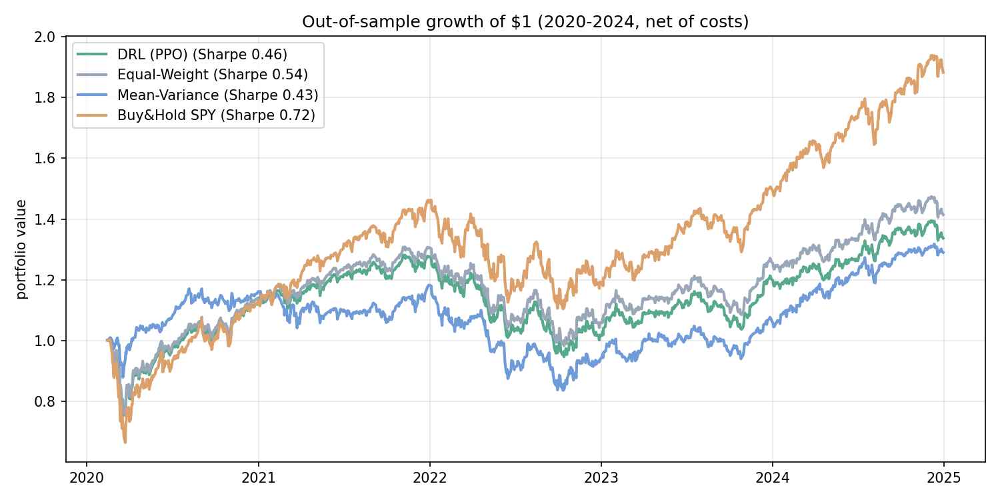
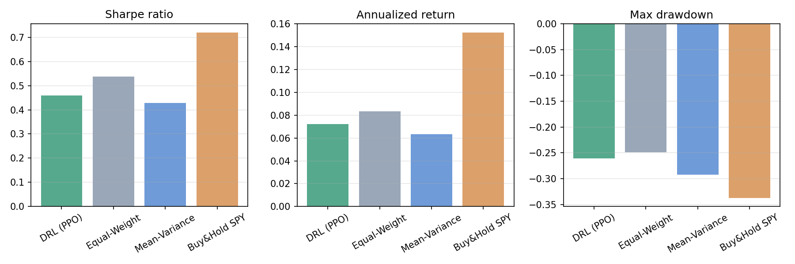
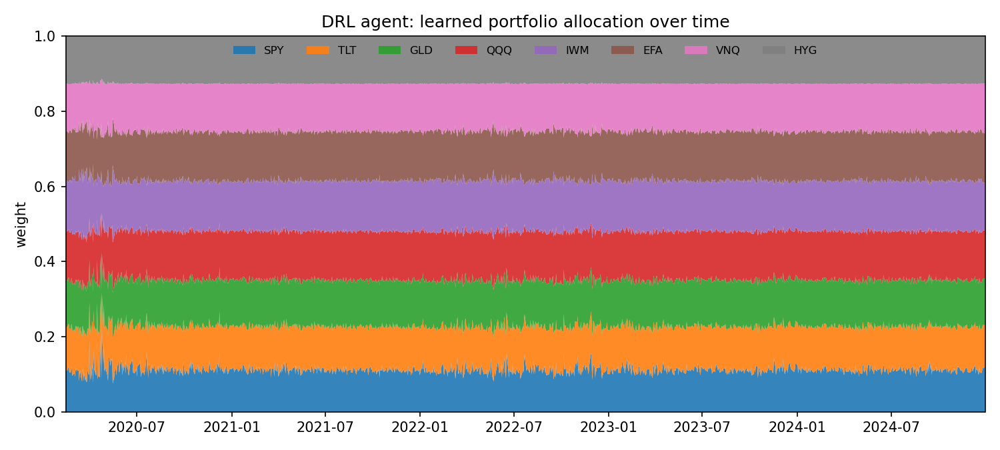

# Deep RL for Portfolio Allocation

**A reinforcement-learning agent that learns to allocate a multi-asset portfolio day by day — benchmarked, leakage-free, against classic baselines.**

A PPO agent (Stable-Baselines3) trades a custom Gymnasium environment over a diversified 8-ETF universe (equities, bonds, gold, REITs, high-yield). Its reward is a **differential Sharpe ratio** — a risk-adjusted objective — and its weights are **tilted around an equal-weight core** so it allocates rather than gambles. It's evaluated out-of-sample against equal-weight, rolling mean-variance (max-Sharpe), and buy-and-hold SPY.

## Results

Trained on 2010–2019 and tested on **2020–2024** (a genuine regime-shift stress test: the COVID crash and the 2022 bear market), net of transaction costs:

| Strategy | Sharpe | Ann. return | Max drawdown |
| :--- | :---: | :---: | :---: |
| **DRL (PPO)** | **0.46** | 7.2% | **−26.1%** |
| Equal-Weight (1/N) | 0.54 | 8.3% | −24.9% |
| Mean-Variance (max-Sharpe) | 0.43 | 6.3% | −29.3% |
| Buy & Hold SPY | 0.72 | 15.2% | −33.7% |



The DRL agent **beats classic mean-variance optimization** on risk-adjusted return and keeps drawdown well below a concentrated SPY position, landing on par with the equal-weight benchmark — which is [notoriously hard to beat out-of-sample](https://doi.org/10.1093/rfs/hhm075). SPY's higher raw return reflects an exceptional 2020–2024 equity bull; the diversified strategies trade that upside for materially smaller drawdowns.



The learned allocation stays diversified while tilting across the universe over time:



## How it works

- **Environment** (`portfolio_env.py`): state = the last 30 days of asset returns + current weights; action = a softmax-normalized, long-only, fully-invested weight vector; reward = the differential Sharpe ratio of the next-day return, net of proportional transaction costs.
- **Agent:** PPO (`MlpPolicy`) from Stable-Baselines3.
- **Risk control:** the differential-Sharpe reward targets return *per unit of volatility*, and weights tilt around an equal-weight anchor to cap concentration — together these prevent the churning / single-asset betting that naive return-maximizing agents fall into.
- **Baselines:** equal-weight, a rolling 252-day mean-variance (max-Sharpe) optimizer rebalanced monthly, and buy-and-hold SPY.
- **No leakage:** strictly chronological train/test split; the mean-variance optimizer only ever uses trailing data; all strategies are scored by the *same* cost-aware backtester.

## Run it

```bash
pip install -r requirements.txt
python download_data.py     # fetches daily prices via yfinance
python train.py             # trains PPO, runs baselines -> assets/ + results/
```

## Repo structure

```text
portfolio_env.py  custom Gymnasium portfolio-allocation environment
train.py          train PPO, build baselines, backtest, evaluate, plot
download_data.py  fetch the asset-universe price history
assets/           equity curves, risk/return, and allocation figures
results/          metrics.csv / metrics.json
```

## Tech stack

Python · Stable-Baselines3 (PPO) · Gymnasium · NumPy / Pandas / SciPy · Matplotlib · yfinance
